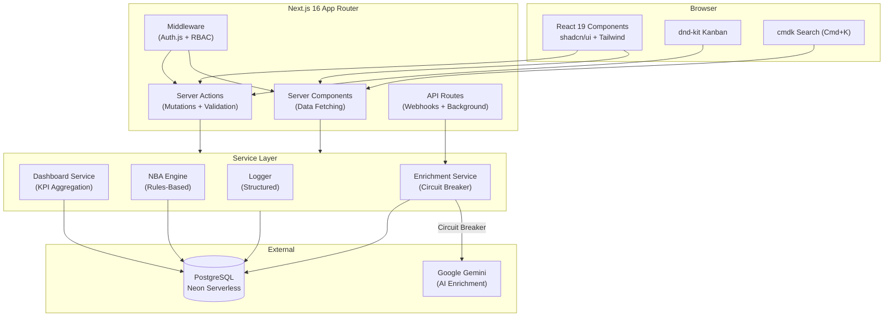

# RedStones CRM

> A full-featured sales CRM built as a custom solution demo — contact management, deal pipeline with drag-and-drop Kanban, AI-powered company enrichment, and real-time analytics dashboard.

<!-- TODO: Replace with Remotion-generated hero GIF -->
<!--  -->

## Quick Start (Guest Mode)

No registration required. Click **"Entra come Guest"** on the landing page to explore the full application with curated seed data.

```bash
pnpm install
cp .env.example .env.local
# Configure DATABASE_URL (Neon) and AUTH_SECRET
pnpm db:migrate
pnpm dev
```

## Architecture



## Key Features

| Feature | Implementation |
|---------|---------------|
| **Contact & Company CRUD** | Server Actions + Zod validation, inline entity creation, tag management |
| **Deal Pipeline** | Kanban board with dnd-kit drag-and-drop, lost reason tracking, stage change timeline |
| **AI Enrichment** | Google Gemini integration with circuit breaker pattern (3 failures → 2 min cooldown) |
| **Analytics Dashboard** | KPI cards (pipeline value, win rate, velocity), deal-by-stage chart, stagnant deal detection |
| **Next Best Action** | Deterministic rules engine — no AI latency, zero cost, fully testable |
| **Global Search** | Cmd+K overlay with cross-entity search (contacts, companies, deals) |
| **RBAC** | 3 roles (Admin/Member/Guest) with JWT sessions, permission-checked server actions |
| **Guest Mode** | Zero-friction demo with auto-seeded data, seed reset per session |

## Tech Stack

| Layer | Technology | Rationale |
|-------|-----------|-----------|
| Framework | Next.js 16, React 19 | Server Components for data, Server Actions for mutations |
| Language | TypeScript (strict mode) | `exactOptionalPropertyTypes`, `noUncheckedIndexedAccess` |
| Database | PostgreSQL (Neon) | Serverless, auto-suspend, WebSocket pooling |
| ORM | Drizzle | Zero binary, sub-100ms cold starts, Edge-compatible ([ADR 0002](docs/adr/0002-use-drizzle-orm-over-prisma.md)) |
| Auth | Auth.js v5 | JWT sessions, RBAC embedded in token |
| Validation | Zod | Shared schemas between client forms and server actions |
| UI | shadcn/ui + Tailwind CSS 4 | Consistent design system, zero custom components |
| Testing | Vitest + RTL | 56 test suites, 523 tests |
| AI | Google Gemini | Company enrichment with graceful degradation ([ADR 0003](docs/adr/0003-ai-enrichment-resiliency.md)) |

## Architecture Decisions

This project follows the [Architecture Decision Record](https://adr.github.io/) (ADR) methodology. Key decisions are documented in [`docs/adr/`](docs/adr/):

| ADR | Decision | Summary |
|-----|----------|---------|
| [0001](docs/adr/0001-use-nextjs-server-actions-for-mutations.md) | Server Actions over API Routes | ~40% less boilerplate, type-safe RPC, progressive enhancement |
| [0002](docs/adr/0002-use-drizzle-orm-over-prisma.md) | Drizzle ORM over Prisma | 200KB vs 15MB bundle, no binary engine, native Neon driver |
| [0003](docs/adr/0003-ai-enrichment-resiliency.md) | AI Enrichment Resiliency | Circuit breaker, async processing, tri-state status model |
| [0004](docs/adr/0004-guest-first-development-strategy.md) | Guest-First Development | Demo-ready from day one, auth as final layer |
| [0005](docs/adr/0005-rules-based-nba-over-ai.md) | Rules-Based NBA | Sub-millisecond suggestions, zero API cost, deterministic |
| [0006](docs/adr/0006-cookie-based-state-persistence.md) | Cookie-Based State Persistence | Zero SSR flash, cross-module sync, server-readable |

## Project Structure

```
src/
├── app/
│   ├── (auth)/              # Login, signup, landing
│   ├── (dashboard)/
│   │   ├── _components/     # Dashboard-specific (KPI, charts, NBA)
│   │   ├── _lib/            # Dashboard service, search actions
│   │   ├── contacts/        # CRUD + detail + actions + service + tests
│   │   ├── companies/       # CRUD + detail + enrichment UI
│   │   ├── deals/           # Pipeline Kanban + deal detail + timeline
│   │   └── settings/        # Pipeline stages, user management
│   └── api/                 # Auth callbacks, enrichment, seed reset
├── components/
│   ├── shared/              # Reusable (date picker, confirm dialog, page header)
│   └── ui/                  # shadcn/ui primitives
├── hooks/                   # useDateRange, usePermission, useDebounce
├── lib/                     # Auth, constants, circuit breaker, logger, format utils
└── server/
    ├── db/                  # Drizzle schema + connection
    └── services/            # Enrichment, seed, shared queries
```

Each feature module follows the pattern: `_lib/` (actions, service, schema, tests) + `_components/` (UI + tests) + `page.tsx`.

## Testing

56 test suites, 523 tests — all passing.

```bash
pnpm test:run          # Run all tests
pnpm test:coverage     # Run with coverage report
pnpm typecheck         # TypeScript strict check
pnpm lint              # ESLint strictTypeChecked
```

| Category | Coverage |
|----------|----------|
| Business logic (services) | KPI calculations, enrichment parsing, NBA rules, pipeline validation |
| Server Actions | CRUD operations, auth checks, input validation, error paths |
| UI Components | Contact/company/deal forms, tables, filters, Kanban board, search overlay |
| API Routes | Auth callbacks, enrichment endpoint, seed reset |
| Utilities | Circuit breaker (8 tests), logger, currency formatting, date range hook |

## Deployment

### Vercel (Recommended)

Push to `main` triggers automatic deployment. Required environment variables:

```env
DATABASE_URL=          # Neon pooled connection string
DATABASE_URL_UNPOOLED= # Neon direct connection (migrations only)
AUTH_SECRET=           # Random 32-char string
AUTH_URL=              # https://your-domain.vercel.app
GEMINI_API_KEY=        # Optional — enrichment works without it (graceful degradation)
```

### Railway

The application is a standard Next.js project, deployable with `railway up` without additional configuration. Use Railway's PostgreSQL add-on or connect to an external Neon instance.

## Development

```bash
pnpm dev               # Start dev server (Turbopack)
pnpm build             # Production build
pnpm db:push           # Push schema to database (dev)
pnpm db:migrate        # Run migrations (production)
pnpm db:studio         # Open Drizzle Studio (data browser)
```

## License

Private — Built as a custom solution demo for RedStones (Modena).
