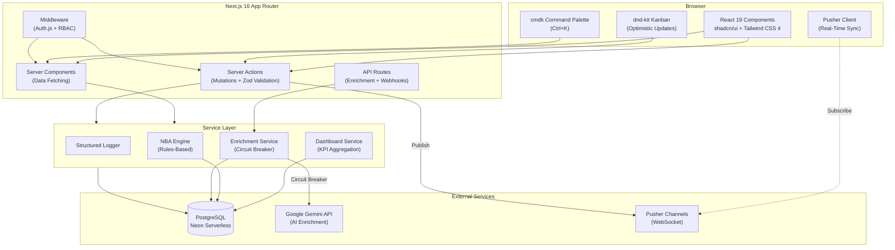

# RedStones CRM

> A custom CRM solution built to spec: contact management, deal pipeline with Kanban drag-and-drop, AI company enrichment, real-time sync, and analytics dashboard. 109 iterative commits, 558 tests, strict TypeScript.

<p align="center">
  
</p>

## Guest Mode (Try It Instantly)

No registration required. Click **"Entra come Guest"** on the landing page to explore the full application with curated seed data. Every feature is accessible, and the data resets on each guest session.

---

## Features

### Contacts & Companies
- Full CRUD with server-side validation (Zod schemas shared between client and server)
- Search, tag management, and enrichment status badges
- Contact detail page with inline editing and tag management
- Company detail page with related contacts and deals
- Inline entity creation (create a company from the contact form, create a contact from the company page)
- Dual address fields (legal and operational headquarters)

### Deal Pipeline
- Kanban board with drag-and-drop (dnd-kit), optimistic card movement, and undo toast
- List view with filters (stage, date range, search)
- Lost reason dialog with predefined options, triggered on drag to "Lost" column
- Optimistic move for lost deals (instant card repositioning)
- Deal detail page with timeline feed (stage changes, notes, activity tracking)
- Contact-company linking in deal form (selecting a contact auto-selects their company, contacts filtered by company)
- Delete button directly on pipeline cards
- Wrapping card titles for long deal names

### AI Enrichment
- Google Gemini integration for company data enrichment (sector, description, employee count, revenue, etc.)
- Circuit breaker pattern: 3 consecutive failures trigger a 2-minute cooldown
- Manual edit for AI-generated fields (override or correct the enrichment data)
- Background processing with `next/server after()` for non-blocking UX
- Graceful degradation: enrichment is optional, the app works fully without a Gemini API key

### Analytics Dashboard
- KPI cards: total pipeline value, win rate, average deal velocity, active deals count
- Deals-by-stage bar chart with distinct colors per pipeline stage
- Deal status distribution chart (won/lost/open breakdown)
- Lost deals breakdown by reason (identify why deals are being lost)
- Stagnant deals list (deals stuck in a stage beyond threshold)
- Next Best Action suggestions (rules-based engine, deterministic, zero API cost)
- Date range filter with cookie persistence (no flash on SSR, synced across modules)

### Real-Time Sync
- Pusher WebSocket integration for pipeline board updates
- Real-time enrichment status badge on company detail
- Multi-user board sync (drag a card in one tab, see it move in another)

### Search & Navigation
- Cmd+K global command palette (cross-entity search: contacts, companies, deals)
- Loading skeletons for contacts, company detail, and settings pages
- Guest tutorial overlay for first-time visitors

### Auth & RBAC
- Auth.js v5 with JWT sessions and role-based access control
- Three roles: Admin, Member (sales rep), Guest
- Permission-checked server actions (admin-only operations enforced server-side)
- Sign-in / sign-up forms with server-side validation
- Demo/guest mode with auto-seeded data and session-scoped reset

### Settings
- Pipeline stage customization (add, reorder, rename stages)
- Admin user management (invite, role assignment)

---

## Tech Stack

| Layer | Technology | Why |
|-------|-----------|-----|
| Framework | Next.js 16, React 19 | Server Components for zero-JS data fetching, Server Actions for type-safe mutations |
| Language | TypeScript (strict) | `exactOptionalPropertyTypes`, `noUncheckedIndexedAccess` enabled |
| Database | PostgreSQL (Neon) | Serverless with auto-suspend, WebSocket-based connection pooling |
| ORM | Drizzle | Zero binary dependency, sub-100ms cold starts, Edge-compatible |
| Auth | Auth.js v5 (next-auth) | JWT sessions with RBAC claims embedded in token |
| Validation | Zod | Shared schemas between client forms and server actions |
| UI | shadcn/ui + Tailwind CSS 4 | Consistent design system, accessible components |
| Drag & Drop | dnd-kit | Kanban board with multi-container support |
| Real-Time | Pusher Channels | WebSocket-based pipeline sync across clients |
| AI | Google Gemini | Company enrichment with structured output parsing |
| Testing | Vitest + React Testing Library | 57 test suites, 558 tests |
| Search | cmdk | Cmd+K command palette |

---

## Architecture



Data flows through three layers: React components call Server Actions (mutations) or render via Server Components (queries). The Service Layer encapsulates business logic, KPI calculations, and external integrations. All database access goes through Drizzle ORM with parameterized queries.

---

## Getting Started

### Prerequisites

- Node.js 20+
- pnpm 9+
- A Neon PostgreSQL database (free tier works)
- (Optional) Gemini API key for AI enrichment
- (Optional) Pusher app for real-time sync

### Setup

```bash
git clone https://github.com/your-org/redstones-crm.git
cd redstones-crm
pnpm install

cp .env.example .env.local
# Fill in the required environment variables (see below)

pnpm db:migrate        # Run database migrations
pnpm dev               # Start dev server (Turbopack)
```

### Environment Variables

```env
# Required
DATABASE_URL=          # Neon pooled connection string
DATABASE_URL_UNPOOLED= # Neon direct connection (for migrations only)
AUTH_SECRET=           # Generate with: openssl rand -base64 32
AUTH_URL=              # http://localhost:3000 (dev) or your production URL

# Optional
GEMINI_API_KEY=        # Google AI Studio key (enrichment degrades gracefully without it)
NEXT_PUBLIC_APP_URL=   # Public app URL

# Optional (Real-Time)
PUSHER_APP_ID=
PUSHER_SECRET=
NEXT_PUBLIC_PUSHER_KEY=
NEXT_PUBLIC_PUSHER_CLUSTER=
```

---

## Testing

57 test suites, **558 tests** -- all passing.

```bash
pnpm test:run          # Run all tests
pnpm test:coverage     # Run with coverage report
pnpm typecheck         # TypeScript strict mode check
pnpm lint              # ESLint with strictTypeChecked config
```

| Category | What is Tested |
|----------|----------------|
| Business logic | KPI calculations, enrichment parsing, NBA rules, pipeline validation, currency handling |
| Server Actions | CRUD for all entities, auth checks, input validation, error paths, cascade protection |
| UI Components | Forms (contact, company, deal), tables, filters, Kanban board, search overlay, dialogs |
| API Routes | Auth callbacks, enrichment endpoint, seed reset, user management |
| Utilities | Circuit breaker (state transitions, cooldown), logger, currency formatting, date range hook |

---

## Project Structure

```
src/
├── app/
│   ├── (auth)/              # Login, signup, landing page
│   ├── (dashboard)/
│   │   ├── _components/     # Dashboard-specific (KPI cards, charts, NBA panel)
│   │   ├── _lib/            # Dashboard service, search actions
│   │   ├── contacts/        # CRUD + detail + actions + service + tests
│   │   ├── companies/       # CRUD + detail + enrichment UI + tests
│   │   ├── deals/           # Pipeline Kanban + deal detail + timeline + tests
│   │   └── settings/        # Pipeline stages, user management + tests
│   └── api/                 # Auth callbacks, enrichment, seed reset
├── components/
│   ├── shared/              # Reusable (date picker, confirm dialog, page header)
│   └── ui/                  # shadcn/ui primitives
├── hooks/                   # useDateRange, usePermission, useDebounce
├── lib/                     # Auth config, constants, circuit breaker, logger, formatters
└── server/
    ├── db/                  # Drizzle schema + Neon connection
    └── services/            # Enrichment, seed, shared queries
```

Each feature module follows the same pattern: `_lib/` (actions, service, schema, tests) + `_components/` (UI + tests) + `page.tsx`.

---

## Architectural Decisions

Documented as [Architecture Decision Records](https://adr.github.io/) in [`docs/adr/`](docs/adr/):

| ADR | Decision | Rationale |
|-----|----------|-----------|
| [0001](docs/adr/0001-use-nextjs-server-actions-for-mutations.md) | Server Actions over API Routes | ~40% less boilerplate, type-safe RPC, progressive enhancement |
| [0002](docs/adr/0002-use-drizzle-orm-over-prisma.md) | Drizzle ORM over Prisma | 200KB vs 15MB bundle, no binary engine, native Neon serverless driver |
| [0003](docs/adr/0003-ai-enrichment-resiliency.md) | AI Enrichment with Circuit Breaker | Prevents cascade failures: 3 errors trigger 2-min cooldown, async processing via `after()` |
| [0004](docs/adr/0004-guest-first-development-strategy.md) | Guest-First Development | Demo-ready from day one, auth layered on top after all features work |
| [0005](docs/adr/0005-rules-based-nba-over-ai.md) | Rules-Based NBA over AI | Sub-millisecond suggestions, zero API cost, fully deterministic and testable |
| [0006](docs/adr/0006-cookie-based-state-persistence.md) | Cookie-Based State Persistence | Zero SSR flash, server-readable on first render, cross-module sync |

### Other Notable Choices

- **Optimistic Updates**: Kanban drag-and-drop updates the UI instantly, then syncs with the server. Failed mutations revert the card position with an error toast.
- **Cents-Based Arithmetic**: All monetary values stored as integers (cents) to avoid floating-point precision errors.
- **Optimistic Locking**: Database-level version checks prevent concurrent edit conflicts.
- **Structured Logging**: Custom logger with severity levels replaces raw `console.log` across the codebase.

---

## Deployment

### Vercel (Recommended)

Push to `main` triggers automatic deployment. Set the environment variables listed above in your Vercel project settings.

### Railway

The application is a standard Next.js project, deployable with `railway up` without additional configuration. Use Railway's PostgreSQL add-on or connect to an external Neon instance. All environment variables are standard -- no vendor-specific configuration required.

---

## Development Commands

```bash
pnpm dev               # Start dev server (Turbopack)
pnpm build             # Production build
pnpm db:push           # Push schema to database (dev)
pnpm db:migrate        # Run migrations (production)
pnpm db:studio         # Open Drizzle Studio (data browser)
pnpm typecheck         # TypeScript strict check
pnpm lint              # ESLint strictTypeChecked
pnpm format            # Prettier formatting
```

---

## License

Private -- Built as a custom solution demo for RedStones (Modena).
